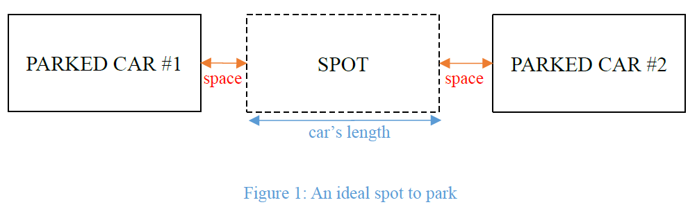
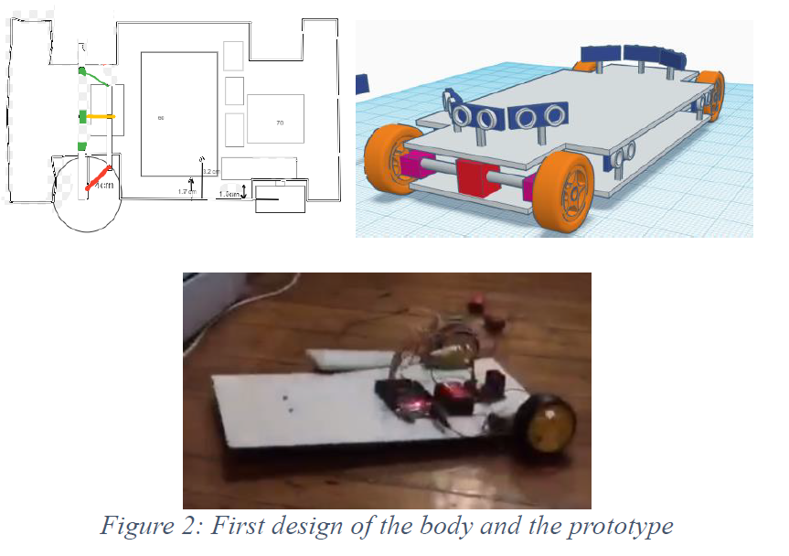
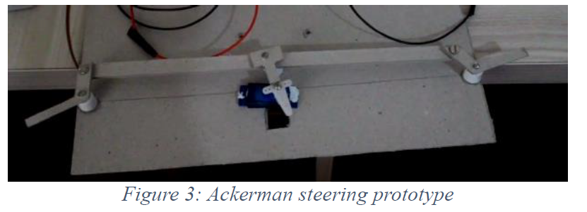
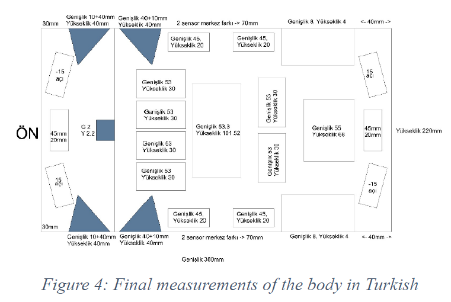
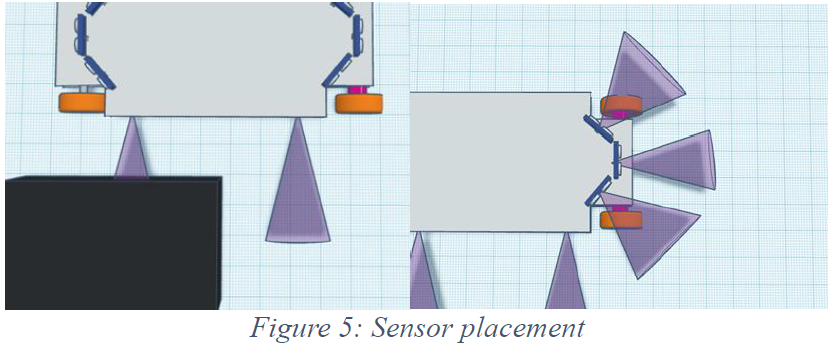
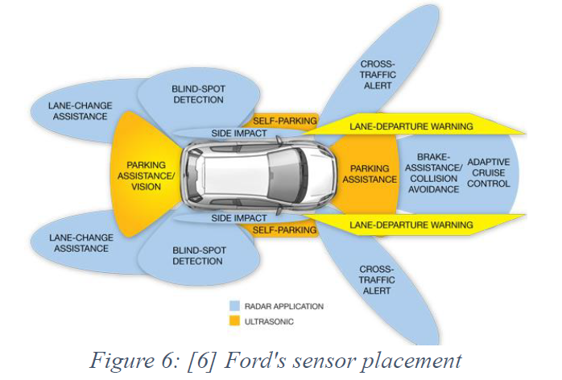
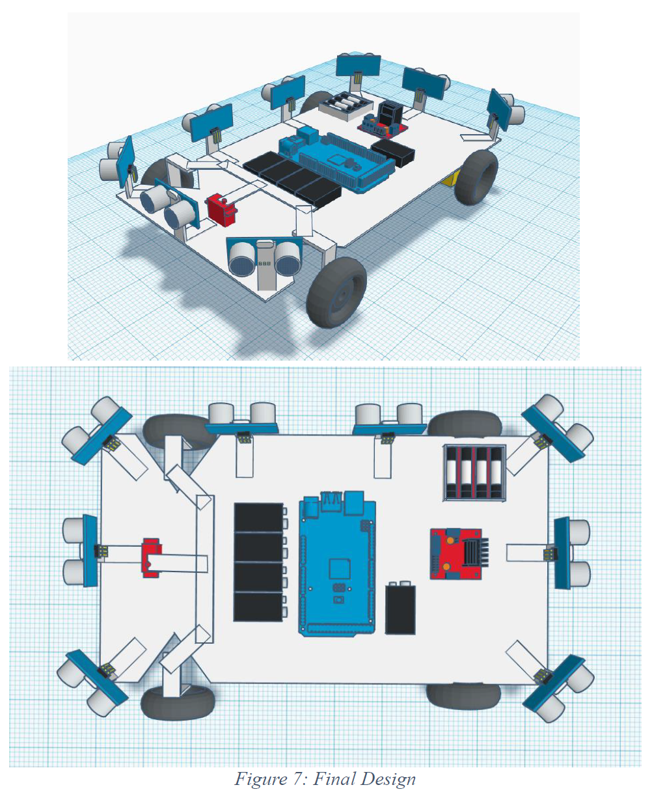
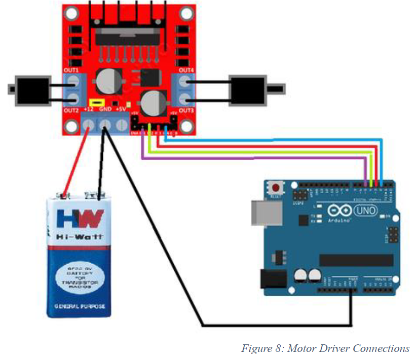
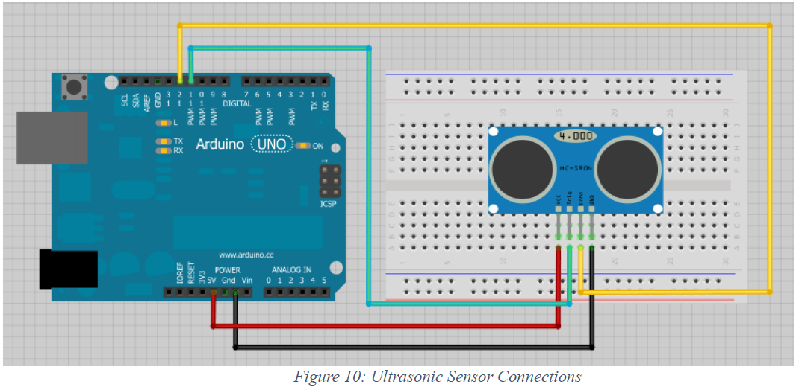

# An Arduino robot that can detect parking spots and park itself

*By 2 Fast 2 Autonomous :*
 - Berkay Giriş   
 - Birkan Denizer   
 - Alperen Özkan  
 - Mustafa Furkan Süve  
 - Salih Can Yurtkulu  
 - Sergen Kayıkçı  

*2017-12-25*

## 1. Abstract

In this project, we have built a robot car that can autonomously park itself. The problems that we worked on were safe exploration and object avoiding in order to detect a parking spot that robot car can fit and park autonomously into that spot.

In order to achieve our goal, we used Arduino, several ultrasonic sensors, 2 DC motors to control the rear wheels and a servo motor to control steering.

Our autonomous robot car is able to drive around safely and search for a park spot that it can fit parallel way. After it detected the spot, it enters into that spot. In effort to isolate the driver from parking process completely, our autonomous robot car can exit from that parking spot too.

## 2. Motivation

Self-driving is an important technology in the automotive industry and many
companies are developing autonomous driving features to add their cars. These companies claim that, the motivation behind this technology is to improve car safety and efficiency. In other words, to help prevent traffic accidents, free up people&#39;s time and reduce carbon emissions.

There are already self-driving features on several vehicles thanks to machine learning and the complex system of sensors, cameras and software that helps vehicles absorb data from their environments and learn and respond to what the data is telling them [1]. Many companies such as Ford, BMW, Tesla, Google etc. are making several, big investments in self-driving cars [2]. Especially, Ford is making huge investments to improve self-driving technology and it states that it will ship self-driving cars by 2021. It can be realized from Ford&#39;s announcements and investments that the company wants to be the leader in the autonomous car market. However, it seems that Ford is not the only car manufacturer which will approach success in self-driving car industry; Tesla and BMW are also making big investments and continue to create new self-driving features [3]. Even Uber is testing out and investing $300 million to further develop a fleet of self-driving vehicles [1].

Our motivation behind this project is finding parking spots is really hard, stressful and time consuming, especially in big cities. In addition, parking a car is stressful and difficult problem for several drivers. The key idea of automatic parking is to plan and decide steering angle and speed, in order to achieve the desired parking operation by performing environment recognition. The parking maneuver is performed as a sequence of controlled motions using sensor data from range measurements about the environment. The steering and velocity controls are computed in real time and executed. The approach results in various path shapes required to perform parking maneuvers.

## 3. Background

The main goal of this project is to build a car that can park itself to a parking spot in parallel fashion. In order to achieve this goal, the car needs to perform some operations in quick successions. First, the car needs to align itself with a wall so it can start searching for a suitable parking slot. When it is aligned, it should check its distance to the wall in order to measure length and depth of a parking spot as it moves. Once a spot with ideal requirements (Figure 1) is found, it should execute parking maneuvers while also checking distance to any objects that might be in the vicinity. If the parking operations are completed, the car will wait a few seconds before performing the next operation that is exiting from the spot. In order to exit from the spot, the car will check its side sensors while moving away from the spot so it can align itself with the wall that is the ending condition for this operation.

In order to rotate a vehicle, steering mechanisms are required. Most of these steering mechanisms works with Ackermann principle. During turning if I-centers of all wheels meet at a point, then the vehicle will take turn about that point which results in pure rolling of the vehicle. The condition is called the Ackerman condition and this principle is known as Ackermann principle [4]. Ackermann steering geometry relates the steer angle of an inside tire to that of the outside tire. When turning the inside tire travels a shorter radius than the outside tire and thus must have a greater steer angle to avoid tire scrub. Classic Ackermann minimizes scrub by positioning both tires perpendicular to the turn center. It can have a significant impact on tire wear [5].

In terms of hardware, Arduino platform is used in order to control motors and sensors. The car features two 6V 250RPM DC motors at the back to provide movement in vertical axis. These two DC motors are connected to a 9V motor drive controller called L298N, which is connected to an Arduino Mega. A single servomotor called Power HD Mini Servo HD-1160A exists in the front of the vehicle to give directions to Ackerman Steering system. Last working version of the system included nine ultrasonic range sensors called HC-SR04 to measure the distance. Relative positions of these sensors were three sensors at the front, three sensors at the back and three sensors at the right. To power all these components multiple groups of batteries were used. The Arduino Mega and all eight connected ultrasonic range sensors were powered by a single 9V battery. The servo at the front was powered by four 1.5V batteries that were connected in serial mode in order to achieve desired 6V high power mode. Lastly, the motor drive controller at the back and connected two DC motors were powered by four 9V batteries that were connected in parallel mode in order to get longer usable time.

## 4. Design

The scope of the project consists of a controller for physical actuation of the car and consists of a significant body of work. Our system is based on mainly two parts: Electrical and Mechanical.

While deciding for the dimensions of the car, we came up with some bold calculated measurements and body design (Figure 2). However, our design was always changing and we decided to build a prototype with cardboard at first. So that, we obtained smooth numbers to shape the body (Figure 4). For the mechanical part, we built body of the car from thin wood. We gave shape to the thin wood by cutting and using sandpaper. The reason why we used wood as the body material was wood being solid enough to tolerate electrical component weights without bending.

The other crucial point while designing the body was building Ackermann steering. Since the first application was successful we built another prototype for steering and obtained our measurements from that prototype (Figure 3).

For the electrical part, we chose Arduino to control the whole process. The reason why we chose Arduino is; its being cost efficient for this project, and its components are easy to find/work with. We needed two DC motors to turn the wheels. In addition, we had to use a servomotor for controlling the steering. We designed our car to be rear wheel drive so that we do not have to deal with controlling different speeds for differential front wheel drive.

We decided to work with ultrasonic sensors to determine the distance of the walls around or along the path of the vehicle and detecting the parking spot. For detecting parking spots, we inspired from Ford&#39;s design shown in the Figure 6. As shown in the Figure 4 we needed three sensors in the side to detect the parking slot, and three sensors each for front and rear to detect walls or obstacles while driving the car.
In summary, we designed our car as in the Figure 7. In the light of the given design details the full requirements list is given in Table 1.

| **Amount**  | **Component**  |
| :------------ | :------------ |
| 1  | Arduino Mega 2560  |
| 1  | Dc Motor Driver L298N  |
| 2  | Dc Motor and Wheel kit  |
| 1  | Servo motor  |
| 9  | Ultrasonic Distance Sensor HC-SR04  |
| 5  | 9V Battery  |
| 4  | 1.5V Battery  |
| 2  | Shopping cart wheels  |

## 5. Construction of the robot

### 5.1. Hardware

1. **Arduino Mega:** Arduino Mega is a microcontroller kit for building digital devices and interactive objects. We used Arduino Mega 2560 since it had more pins compared to other Arduino microcontrollers.

	**Properties:**
		Voltage: 9V
		Digital I/O Pins: 54
		Analog I/O Pins: 16
		DC Current per I/O Pin: 40mA
		Flash Memory: 128kb 
		Clock Speed: 16Mhz

2. **Motor driver:** Motor driver converts low-current signals come from Arduino into high-current signals in order to drive motors. We used L298N Dual H Bridge DC Motor Driver.

	**Properties:**
		Voltage: 9V
		Current input: 0mA – 36mA
		Current Output: 2A
		Max Power: 25W
		Size: 43mm x 43mm x 26mm
		Weight: 26g

	Connections:

3. **Dc Motors:** DC motor is a machine that converts electrical energy into mechanical energy. We used two DC motors for rear wheels.

	**Properties:**
		Voltage: 6V
		Round Speed: 250 RPM
		Weight: 29g

4. **Servomotor:** Servomotor is a rotary actuator that controls angular position, velocity and acceleration. We used a single servomotor to control front wheels.

	**Properties:**
			Speed: 60°/0.12s
			Torque: 3kg/cm
			Max Current: 800mA
			Min Current: 5mA
			Weight: 16g
			Size: 28mm x 13,2mm x 30,2mm
			Motor Degree: 180°

	Connections:

5. **Wheels:** Wheel is a mechanical component that provides movement. We used two Shopping cart wheels for front and two regular wheels for rear and two L bars to fix front wheels to robot&#39;s body.

	**Rear Wheel Properties:**
		 Diameter: 64mm
		 Width: 28mm
		 Weight: 45g

	**Front Wheel Properties:**
		 Diameter: 74mm
		 Width: 22mm
		 Weight: 60g

6. **Ultrasonic Sensors:** Ultrasonic sensor is a device that can measure distance by sending out a specific frequency sonic wave and listening for that wave to bounce back. We used nine HC-SR04 ultrasonic sensors and L bars to fix ultrasonic sensors to robot’s body. Three front and three rear sensors are used for obstacle avoidance and side sensors are used for detecting park area and parking.

	**Properties:**
		 Voltage: 5V
		 Current: 15mA
		 Frequency: 40Hz
		 Max Range: 40m
		 Min Range: 2cm
		 Visual Angle: 15°
		 Motor Degree: 180°
		 45mm x 20mm x 15mm

	Connections:

7. **Batteries:** Battery is a device that supply power to electrical components. We used 1x 9V battery for Arduino Mega, 4x parallel 9V battery for motor driver and 4x 1,5V serial battery for servo motor.

8. **Ackermann Steering:** Ackermann Steering relates front wheels to each other in order to move around a circle with same angular velocity and different linear velocity. We built our Ackermann steering mechanism by using wooden pieces, bolts, nuts and washers. After calculating the angles and sizes of Ackermann components, we cut the wooden pieces and made holes on them with drill. Then we attached those pieces with bolts, nuts and washers.

### 5.2. Software

Until work package 1(WP1), the software that was running on the Arduino was very simple in terms of design. The sensor data was read and then related obstacle avoidance function was executed in every iteration of the loop. This basic design served us well in the first work package, as there was not more than one state. However, in order to accomplish desired work package two (WP2) goals, software logic needed to be changed. In this first iteration of the new design, a two-state logic was created with states being detecting and parking, respectively. The robot was initialized in detecting state and if requirements for parking were met while running detecting state, then it would change state. In the upcoming iteration of the loop, the parking maneuvers would be executed. If the ending conditions were met, the robot would stop the movement. After tremendous testing of the existing design, exiting from parking slot was added as a new state. In this new iteration of the design, there were three states total and if the detecting state was completed, then the logic would make a choice based on whether the car was parked or not. If it was not parked, it would execute related parking function. If it was parked, it would execute related exiting from park function and stop the movement.

Some libraries such as ElapsedMillis, Servo and math were added to implement some functionalities. For example, ElapsedMillis provides elapsed time information to calculate the speed and thus distance information for detecting state to work. Servo library is used to control the servo in the front. Finally, math library is used to calculate absolute value of distance differences in detecting.

In the last iteration of the design, there were nine sensors and these sensors were read by single function. In this function, return value of the sensors would be in microseconds and then it would be converted to centimeters to be used in calculating distance. In the WP1, there were some noticeable delays caused by sensor as their default timeout values were one seconds. In order to improve this, a max value of 2 meters, or 11600 microseconds, was given to pulseIn function.

In the alignment function, three different sensors were used in order to get the robot parallel to the wall. Rightmost sensor at the front was used to measure distance between corner of the robot and the wall. In addition, two side sensors were used to calculate the angle of the car relative to the wall. Based on this calculation the robot was rotated left or right to become parallel to the wall. If the robot was parallel to the wall, the state would be changed to detecting.

In the spot detection function, the main problem was getting unwanted noise from sensors. The sensors would sometimes return values that were completely wrong. To solve this problem, a filter was added so if there was an odd value in the sensor data, it would be ignored and replaced with mean value of next and previous data. However, a side effect of this was running the robot with data that was one cycle old. After sorting the noise problem, the results from side sensors were compared and if the difference between previous and current value passed a certain threshold, it would mean the robot detected a possible parking spot and measuring its distance. If another difference between sensor data was detected, the total measured distance would be calculated and compared against another threshold value. If the calculated distance was greater than the parking distance threshold, the robot would change state in order to start parking. If the calculated distance was smaller than the threshold, then it would continue searching.

In the parking function, there were two different phases called parkFirstPhase and parkSecondPhase, respectively. Based on values coming from side and back sensors, a phase shift would happen from parkFirstPhase to parkSecondPhase. If the robot was closer to the wall than defined threshold value, then it would stop and exit from the park function while setting the flag for exitPark function true, thus signaling a state transition from parking to exiting from the park.

In the exiting from park spot function, there were two different phases just like parking function. The same logic is applied here with the difference being the sensors that are checked. An additional side sensor was used to calculate the angle to the wall. If the robot successfully left the parking area, it would be the end of movement, thus robot would halt.

## 6. Results and Evaluation

In the Analysis and Design processes of this project, we decided to split the tasks we will into two as work package 1 and work package 2. We assign each group member a specific task for each work package.

The work package 1 was about bringing the actual robot into existence. For achieving this, we build the electrical components of the car that includes an Arduino, two motors that push the car forward, one servo to make the car be able to steer and some batteries that power all these components. We have multiple batteries to power different components. Since the motors drive so much power, we occasionally run out of battery and needed to replace them with the new ones. Furthermore, we decided that our servo had not enough torque; therefore, we change it with the one having more torque.

We also did a mechanical design for the car. We calculated the sizes of the components and decided where to put each component. At first, we wanted to put the DC motors into the front wheels but then we decided not to that and put them to the wheels on the back. That was because we did not want it to have a differential movement and we wanted to separate the servo and DC motors. We also realized that the servo could not turn enough because of the space that the platform gives. Therefore, we decided to give more room to the steering wheels by cutting some of the standing platform.

Then we used the Ackermann design for the steering part of the car. We observed that Ackermann could stuck on the other component sometimes and the screw we used to stabilize it could wiggle. We move the components around a bit and tightened the screw so that it becomes more stable. Hence, the car could steer better and started to behave more like what we wanted.

For the work package 1 we decided to have the robot detect the obstacles and avoid them. It was successful in avoiding the obstacles in the environment we provided in the test phase of the first Work Package. We achieved that by rotating the front wheels by powering the servo with the proper value and moving the car backward or forward according to the obstacle position. Other than the mentioned issues above, all parts were correct for the work package 1. In addition, these issues are solved as we mentioned above.

Having a real world robot, we continued into work package 2 where we would do the actual parking and exiting tasks. We tried to create a software that makes the car behaves according to this scenario: Firstly, it will try to detect the parking slot and try determining the length of it. Secondly, considering the length of the slot, it either starts parking or stops. If it started parking, it will try to exit after a while.

For the determination of the parking slot, we used the two sensors on the side. Since we knew the distance between them, we tried to estimate the speed of the car as it was passing by the beginning of the slot. However, since out sensors was not perfect, we encountered some noises. These noises were confusing the software and it sometimes miscalled if it was passing by the parking slot and if it finished passing by the slot. Because of that, it sometimes drove past the slot and continued moving. In addition, sometimes it decided that it got the position after detecting the parking slot even though it was in the middle of it.

Besides this error, it sometimes could not calculate the distance well. That is because the lower data rate coming from the sensors comparing the speed of the car, noises and the imperfect environment conditions. Because of these miscalculations, it sometimes decided that it could not fit that area even if it could or it tried to park a slot that it could not fit. We tried to give a constant velocity but because the changing speed of the car due to the battery power or the condition of the road, this did not seem to work. Therefore, we tried to improve it with small tweaks on the variables and parameters.

Since the problems above were caused by the noises, we tried to filter out the noise by comparing the data coming from sensors with the previous and the next one. Although it took us back by the time reading one data from the sensors, it did not matter much as this time is very small.

Having improved the detection of parking slot, this approach did not fully solve the problems. However, it was mostly successful on parking and exiting. The parking sequence sometimes failed because it could not take the proper position before parking. However, if it does take that position and it correctly decides the length of the slot with a minor error, it successfully parks and exits from the slot.

## 7. Expectations and Acknowledgements

We had problems while realizing our proposed project because of the real world circumstances and the materials that we used.

### 7.1. Lagged acting
**Expectation:** We expected our autonomous car to move smoothly.

**Acknowledgement:** We have 10 sensors on our car. We take all sensor data as an array. If the distance measured by the sensor is long, it takes more time to return. In order to move according to the correct distance data, we set a delay so car uses the incoming sensor data rather than the old one.

**Improvement:** At the work package 2, we designed a new algorithm for taking the sensor data. It simply ignores the data coming from the sensors that has latency more than our fixed threshold.

### 7.2. Insufficient power for turning wheels left or right
**Expectation:** We thought our servo is powerful enough.

**Acknowledgement:** Our servo was insufficient.

**Improvement:** We bought a new one with more torque, yet we noticed that we made a trade off in means of power and space.

### 7.3. Angled movement instead of perfectly straight movement
**Expectation:** We expected our car to move forward straight:

**Acknowledgement:** Because of our imperfect Ackerman steering, our car does not move forward straight. We built our Ackerman steering mechanism from wooden pieces. Extracting the necessary parts from the wooden plate was hard for us because of our insufficient material. In addition, Ackerman steering has moving parts, friction between these parts was one the reasons for angled movement.

**Improvement:** We set our servo angles according to our imperfect Ackerman steering system. For example, we set 92 degrees instead of 90 degrees.

### 7.4. Erroneous movements while detecting the parking spot
**Expectation:** We expected to detect parking spot easily.

**Acknowledgement:** Our car sometimes moves erroneous because of the incorrect sensor data and incorrect calculation for the length of the parking spot. We tried different methods like mean filtering to eliminate noisy data coming from sensors but we could not achieved it. Because of the limited computational power of the Arduino, these operations caused intolerable delays.

**Improvement:** We used simple methods like creating thresholds instead of filtering.

### 7.5. Erroneous calculation for the length of the parking spot
**Expectation:** We expected to calculate the length of the parking spot easily.

**Acknowledgement:** We could not calculate the length of the parking spot correctly, because we do not know the speed of the car.

### 7.6. Unknown speed
**Expectation:** We expected to calculate the speed with dividing the distance between our two side sensors to the elapsed time between the distance changes on side sensors.

**Acknowledgement:** We calculated the speed with this method but, when we used this speed for calculating the parking spot&#39;s length, results were unrealistic.

### 7.7. Dynamic delay length after finding the parking spot according to battery power
**Expectation:** We expected to position the car with no problem after detecting parking spot.

**Acknowledgement:** We used a delay for positioning the car before parking routine. With this delay, after detection of the parking spot, car moves a little bit more but car’s speed changes according to battery power. So same delay has different effects according to battery power. We do not know a way for calculating the battery power so we could not set a dynamic delay length.

## 8. References

- [1] B. Marr, "Forbes," 6 November 2017. [Online]. Available: https://www.forbes.com/sites/bernardmarr/2017/11/06/the-future-of-the-transportindustry-iot-big-data-ai-and-autonomous-vehicles/#66529c031137. [Accessed 24 December 2017].
- [2] D. Muoio, "Business Insider," Business Insider Inc., 27 September 2017. [Online]. Available: http://www.businessinsider.com/the-companies-most-likely-to-getdriverless-cars-on-the-road-first-2017-4/#1-ford-18. [Accessed 24 December 2017].
- [3] D. Newman, "Forbes," 27 September 2016. [Online]. Available: https://www.forbes.com/sites/danielnewman/2016/09/27/autonomous-cars-thefuture-of-mobility/#1c6dee2d583b. [Accessed 24 December 2016].
- [4] Koladia, “Mathematical Model to Design Rack And Pinion Ackerman Steering Geometry “ International Journal of Scientific & Engineering Research, Volume 5, Issue 9, September-2014 ISSN 2229-5518
- [5] Mitchell, W., Staniforth, A., and Scott, I., "Analysis of Ackermann Steering Geometry," SAE Technical Paper 2006-01-3638, 2006.
- [6] http://fordaddict.com/self-driving-cars-future-automobiles/
